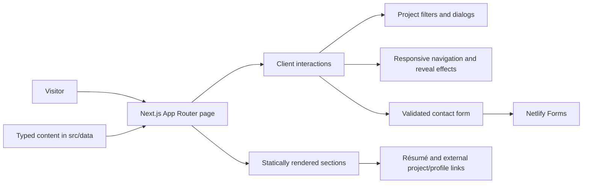

# Jian Ting Li — Personal Portfolio

**A focused, interactive portfolio that helps recruiters and hiring teams quickly evaluate an experienced mobile engineer expanding into AI product engineering.**

[View the live portfolio](https://jianting.netlify.app/) · [Download the résumé](./public/resume.pdf) · [View GitHub](https://github.com/JianTing-Li) · [Connect on LinkedIn](https://www.linkedin.com/in/jiantingli8/)

> A project screenshot or GIF is not currently checked into this repository. The live portfolio is the best available preview.

## At a glance

| | |
| --- | --- |
| **Target user** | Recruiters, hiring managers, and engineering or product leaders evaluating Jian Ting Li for mobile engineering and AI product engineering roles |
| **Problem** | A static résumé cannot show career context, product thinking, project details, or the connection between nearly six years of production mobile work and a growing AI product practice |
| **Solution** | A responsive, single-page portfolio that brings selected work, technical skills, career history, personal context, résumé access, and contact options into one scannable experience |
| **My role** | Designed and implemented the information architecture, visual system, responsive UI, interactions, content model, and contact flow represented in this repository |
| **Project status** | Publicly deployed on Netlify; the current checkout builds successfully as a statically prerendered Next.js site |
| **Core technologies** | Next.js 16 App Router, React 19, TypeScript, Tailwind CSS 4, Netlify Forms |

The strongest engineering signal is the translation of a compact portfolio brief into a typed, component-based product with deliberate client/server boundaries, accessible interaction states, responsive behavior, and explicit form failure handling.

## Why I built it

I wanted an owned, updateable alternative to a résumé that goes stale. The site gives professional reviewers a fast path to the essentials while preserving enough detail to understand how my background fits together: nearly six years contributing to production iOS and Android software at Goldman Sachs, followed by a focused expansion into human-centered AI product development.

The project also demonstrates how I approach product work: start with the audience's decision, reduce the effort required to reach it, and keep implementation details in service of clarity.

## Key capabilities

- **Understand the fit quickly.** The opening frames my mobile engineering foundation and current AI product focus before a reviewer reaches the detailed timeline.
- **Compare relevant work.** Visitors can filter selected projects between work and personal categories, then open focused detail views without leaving the page.
- **Inspect evidence.** Project cards link to the Goldman Sachs Marquee product page, this deployed portfolio, and public repositories for the personal data projects listed in `src/data/projects.ts`.
- **Follow the full career story.** Skills, selected work, career history, personal context, a downloadable résumé, GitHub, and LinkedIn are organized in a single responsive flow.
- **Reach out with clear feedback.** The contact form validates inputs, communicates success or failure, and offers LinkedIn as a fallback when submission fails.

## How it works

Most of the site is statically prerendered from typed local data. React client components are limited to interactions that need browser state: mobile navigation, scroll reveals, project filtering, project-detail dialogs, and the contact form.



The page is assembled in `src/app/page.tsx`; reusable section and UI components live under `src/components`; professional and project content is separated into typed modules under `src/data`; and static assets live in `public`.

## Engineering decisions and tradeoffs

- **Static-first architecture.** The production build prerenders the portfolio as static content, so the core experience has no application database or custom runtime API. This keeps deployment and maintenance small, but content updates require a code change and redeploy.
- **Narrow client boundaries.** Only interactive components use `"use client"`; the page shell and content sections remain server-renderable. The tradeoff is that reveal effects and interactive controls still depend on client-side JavaScript.
- **Typed content model.** Projects, career items, skills, navigation, and personal details are stored separately from presentation. This makes repeated UI consistent and catches content-shape errors at build time, but it is not a nontechnical CMS workflow.
- **Purpose-built UI.** Reusable buttons, containers, sections, headings, tags, and inline SVG icons keep the visual language consistent without a component-library dependency. That also leaves accessibility regression testing to this project.
- **Netlify-native contact handling.** A hidden form in `public/__forms.html` enables Netlify form detection, while the visible React form posts URL-encoded data to that endpoint. This avoids a custom backend but couples successful submission to Netlify's hosting behavior.

## AI responsibilities vs. deterministic logic

This portfolio is **not an AI-powered application**. It describes my AI product development focus and links to relevant work, but this repository contains no model calls, retrieval pipeline, prompt execution, agent workflow, or AI-generated runtime output.

All behavior is deterministic application logic: rendering local data, filtering arrays, opening and closing dialogs, observing viewport intersections, validating contact fields, and submitting form data. That boundary is intentional—AI is part of the professional story presented by the product, not an unnecessary dependency in the product itself.

## Reliability, validation, privacy, and failure behavior

- TypeScript runs in strict, no-emit mode, and the production build performs both compilation and type checking.
- ESLint uses the Next.js Core Web Vitals and TypeScript configurations. The current lint run completes with no errors and one `react-hooks/exhaustive-deps` warning in the project-detail dialog.
- The current production build completes successfully and prerenders `/` and `/_not-found` as static routes.
- The contact form requires a name, a syntactically valid email address, and a message of at least 10 characters. It also includes a honeypot, blocks duplicate in-flight submissions, and applies a 30-second client-side submission throttle.
- Submission checks the HTTP response, handles network exceptions, resets the form on success, moves focus to the status region, and shows an error with a LinkedIn fallback on failure.
- Dialogs support Escape and backdrop dismissal, focus the close control on open, restore focus on close, expose dialog semantics, and respect reduced-motion preferences. The site also provides visible focus styles and semantic navigation labels.
- No application database, analytics SDK, authentication layer, or AI service appears in this repository. Contact details are sent to Netlify when a visitor submits the form; the repository does not define additional storage, retention, or server-side validation behavior.
- Client-side validation, the honeypot, and throttling improve user experience but are not security boundaries. Platform-side spam and abuse controls are outside this repository.

### Testing status

There is currently **no automated unit, component, integration, or end-to-end test suite**, and `package.json` defines no `test` script. The available repository checks are:

```bash
npm run lint
npm run build
```

Both commands were run during the README audit. The build passes; lint reports the single warning noted above.

## Local setup

### Prerequisites

- Node.js 20.9 or newer (the minimum documented for the installed Next.js version)
- npm

No environment variables are required for the site to build or render.

### Install and run

```bash
git clone https://github.com/JianTing-Li/jt-personal-website.git
cd jt-personal-website
npm ci
npm run dev
```

Open [http://localhost:3000](http://localhost:3000).

To verify and run a production build:

```bash
npm run lint
npm run build
npm run start
```

`npm run start` should be run after `npm run build`. The contact form's successful submission path depends on Netlify Forms and is not reproduced by the local Next.js server alone.

## Current limitations and highest-value next steps

1. **Add automated coverage.** Highest priority: end-to-end tests for project filtering, dialog keyboard/focus behavior, mobile navigation, contact validation, and success/error states.
2. **Add visual proof.** Commit an optimized desktop screenshot and mobile screenshot or short GIF, then place the strongest artifact beside the demo link above.
3. **Align the deployment with this checkout.** The public site currently differs from this repository's local project data and copy; the current source should be redeployed when those changes are ready.
4. **Strengthen progressive enhancement.** Scroll-reveal sections depend on JavaScript to become visible, and the project dialog does not currently implement a full focus trap.
5. **Harden the contact flow.** Add documented platform-side spam controls, retention/privacy details, and automated verification in a Netlify preview deployment.
6. **Pin the runtime.** Add a project-level Node version declaration or `engines` field so local and deployment environments use the same supported runtime.

Planned items above are not implemented in the current repository.

## Developer

I'm [Jian Ting Li](https://jianting.netlify.app/), a mobile software engineer with nearly six years of production iOS and Android experience who is expanding into AI product engineering. I focus on useful products, clear interactions, and dependable implementation.

- [Portfolio](https://jianting.netlify.app/)
- [GitHub](https://github.com/JianTing-Li)
- [LinkedIn](https://www.linkedin.com/in/jiantingli8/)
